# Dopomogai OS: V2 API & Ghost Cursor Architectural Blueprint
## 1. Executive Summary (The "Why")
Dopomogai OS is moving from V1 (A Spatial Web Browser) to V2 (An Autonomous Spatial OS). 
Standard AI agents (like standard Playwright bots) operate in "headless" black boxes. Users wait 30 seconds and hope the AI did the right thing. 
Our core differentiator is **Observability and Gamification**. We are forcing the AI to drive the exact Chromium webviews floating on the user's TLDraw canvas. We use a local Python proxy to wrap standard tools (like `browser-use`), pipe the commands through Electron's `9222` debugging port, and stream the real-time X/Y coordinates back to React to draw a "Ghost Cursor".
---
## 2. System Architecture
The architecture relies on 3 independent layers communicating over local ports and WebSockets.
### Layer 1: The Electron Host (The Environment)
- **Role:** The host application rendering the TLDraw canvas and `<webview>` tags.
- **Port:** `9222` (Chromium Remote Debugging Port).
- **Setup:** Electron is booted with `app.commandLine.appendSwitch('remote-debugging-port', '9222')`.
- **Behavior:** Every `<webview>` spawned on the canvas automatically registers as a CDP target on `localhost:9222/json`.
### Layer 2: The Python Agent Engine (The Brain)
- **Role:** The local FastAPI backend running the actual LLM calls and agent lifecycle.
- **Tooling:** We use `browser-use` (or native Playwright) as the core engine.
- **The Hack:** Instead of letting `browser-use` launch a new headless browser, we pass it the URL of the Electron CDP port.
- **State Machine:**
  1. User types cmd: "Find cheap flights on this tab."
  2. Python connects to `localhost:9222`, finds the active tab.
  3. Python requests the DOM Snapshot from the tab.
  4. LLM decides the next action (e.g., `click at 450, 200`).
  5. **Crucial Step:** Before firing the CDP click, Python sends a WebSocket payload to Layer 3.
### Layer 3: The React V2 Bridge (The Gamification)
- **Role:** The UI layer responsible for rendering the Ghost Cursor.
- **Connection:** Maintains a persistent WebSocket connection to the Python backend (e.g., `ws://localhost:8000/ws/cursor`).
- **Behavior:** 
  1. Receives payload: `{"action": "move", "x": 450, "y": 200, "agent": "Librarian", "color": "#ffb868"}`.
  2. React animates a custom SVG cursor moving across the TLDraw canvas to those exact coordinates relative to the target `BrowserWidget`.
  3. Renders a ripple effect when the click occurs.
  4. **Human Override:** If the human user moves their physical mouse, React fires a `{"action": "interrupt"}` message back to Python, immediately freezing the agent's execution tree.
---
## 3. Data Flow Diagram

```mermaid
sequenceDiagram
    participant User
    participant React Canvas (Port 5173)
    participant Electron Main (Port 9222)
    participant Python Backend (Port 8000)
    participant LLM API (OpenAI/Anthropic)
    User->>React Canvas: Types "Book a flight"
    React Canvas->>Python Backend: POST /task {"query": "...", "tabId": "browser_1"}
    Python Backend->>Electron Main: CDP Connect (localhost:9222)
    Electron Main-->>Python Backend: Returns DOM Accessibility Tree
    Python Backend->>LLM API: "Here is the DOM, what next?"
    LLM API-->>Python Backend: "Click button at X:450, Y:200"
    rect rgb(40, 40, 40)
        Note over Python Backend, React Canvas: The Ghost Protocol
        Python Backend->>React Canvas: WS {"type": "GHOST_MOVE", "x": 450, "y": 200}
        React Canvas->>React Canvas: Animate SVG Cursor on Canvas
    end
    Python Backend->>Electron Main: CDP page.mouse.click(450, 200)
    Electron Main->>React Canvas: Tab visually updates
```

---
## 4. Implementation Steps (The "How")
### Phase 1: Electron Port & Target Discovery
1. Add `--remote-debugging-port=9222` to `src/main/index.ts`.
2. Write a lightweight wrapper script in Python (`test_cdp.py`) that queries `http://localhost:9222/json` to prove we can see the exact URLs of the active `<webview>` tabs.
### Phase 2: The WebSocket PubSub
1. Initialize a basic FastAPI server in the `backend/` folder.
2. Create the WebSocket endpoint `/ws/spatial`.
3. In `App.tsx`, build the `useWebSocket` hook that connects and listens for `GHOST_MOVE` payloads.
4. Build a dead-simple React component (`<GhostCursor />`) that sits as an absolute overlay block on the canvas, mapped to raw client coordinates.
### Phase 3: The `browser-use` Proxy
1. Install `browser-use` and `playwright` in the Python virtual environment.
2. Initialize `async_playwright()`. 
3. Call `browser = await p.chromium.connect_over_cdp("http://localhost:9222")`.
4. Patch the `browser-use` execution loop so that immediately before it calls `.click()` or `.type()`, it emits the coordinates to our WebSocket pubsub. 
### Phase 4: The Human Override (Safety Protocol)
1. Add a global `onMouseMove` listener in React.
2. If `GhostCursor` is active and physical mouse delta exceeds 50px, instantly dispatch `WS { action: "override" }`.
3. The Python FastAPI wrapper catches "override" and throws an `AgentInterruptedException`, halting the LLM chain.
---
## 5. Security & Isolation Notes
- **Local Only:** Port `9222` and `8000` must strictly bind to `127.0.0.1` to prevent local network hijacking of the user's active Chromium sessions.
- **Origin Checking:** The WebSocket server must enforce CORS matching the Electron `file://` or `localhost:5173` origins.
### Advanced Interactivity & Visualizing Local Mac/System Apps
The holy grail of a Spatial OS isn't just websites; it's visualizing *native system applications*. 
**Can we show native Mac apps in the canvas?**
Yes, but the approach drastically shifts based on implementation complexity:
1. **WebRTC Streaming proxy (e.g., Kasm Workspace / Guacamole / X11 proxy):** 
   You run a Dockerized version of an app Linux native binary and stream the pixels via WebRTC directly into a `<canvas>` component inside the DL draw wrapper. This is heavily explored for V4 Cloud OS.
2. **Local macOS Window Capture (The OBS Method):**
   Using `desktopCapturer` inside Electron, we can screen-record a specific native macOS window (like VSCode or your terminal) and paint that live video feed onto a `<video>` element on the Spatial Canvas. We proxy the canvas clicks to the native window using Node `robotjs` / `nut.js` to simulate physical hardware interaction. This perfectly achieves the "view native apps spatially" desire, though it introduces a layer of abstraction.
*Current Recommendation:* Stick to `<webview>` components for V2 (Web Apps & Workspaces) and introduce `desktopCapturer` video feeds for V3 natively installed Mac Apps.
